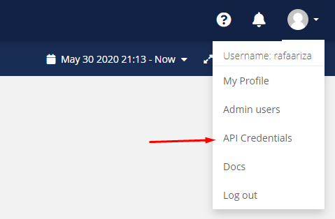

# ISStracker
Sigue a la ISS desde cualquier par de coordenadas.
## Uso
1. Crear una cuenta gratuita para uso personal en [Ubidots](https://ubidots.com/).
2. Obtén tu token desde:  

3. Obtén tus coordenadas en alguna web como [Maps](https://www.google.com/maps).
4. Cambia el token, la latitud y la longitud en el código del programa.
5. Corre el programa y visita la pestaña Devices en tu perfil de Ubidots:
.
¡Ya puedes observar en tiempo real dónde está la ISS y a cuánta distancia de las coordenadas establecidas se encuentra!
